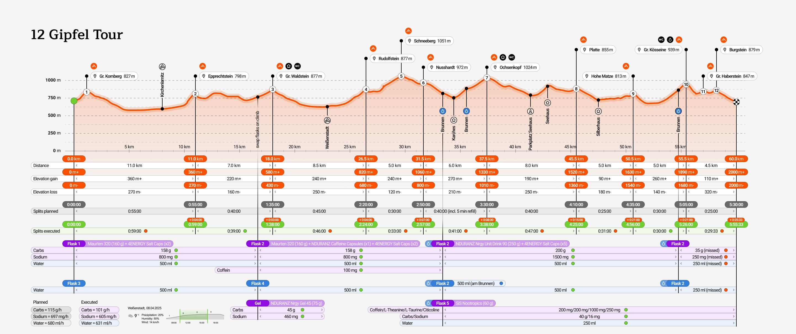
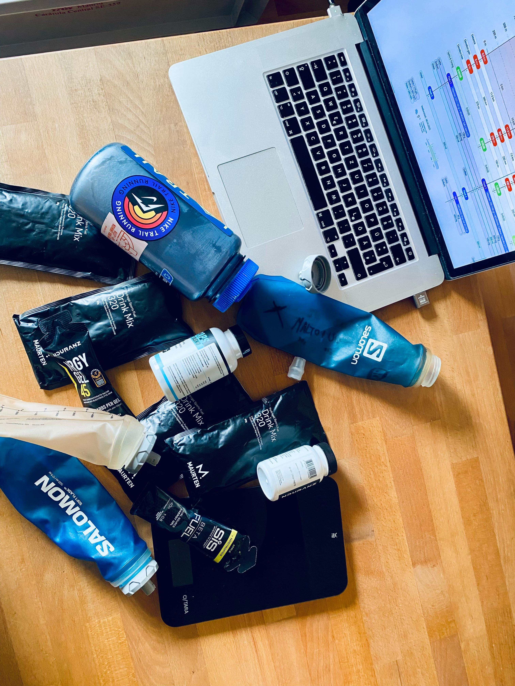
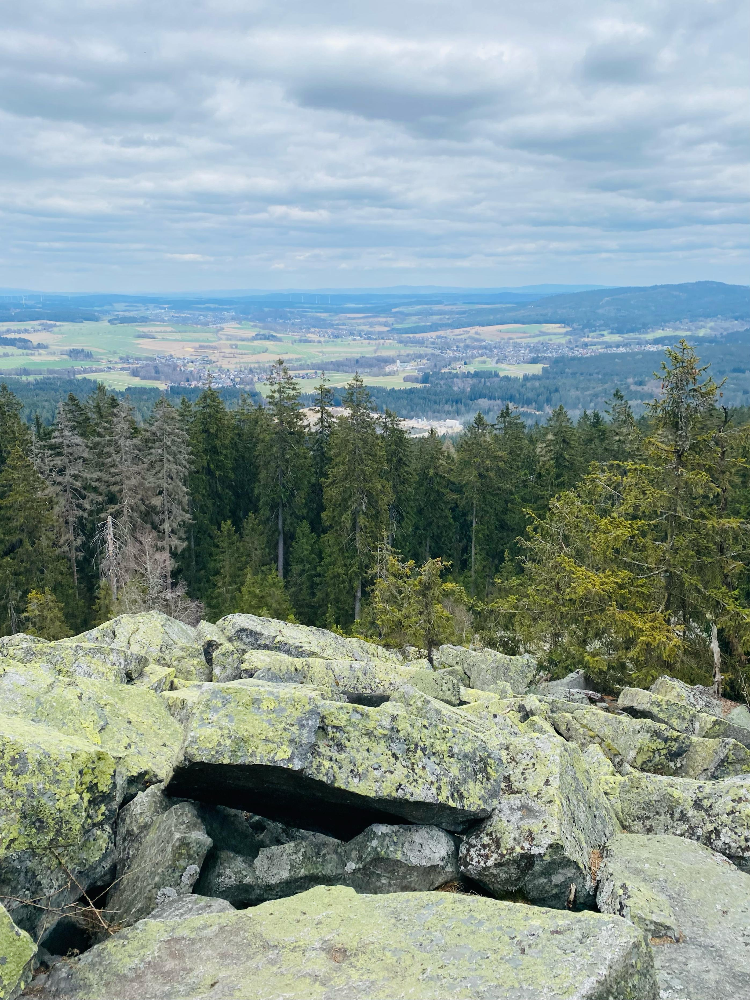
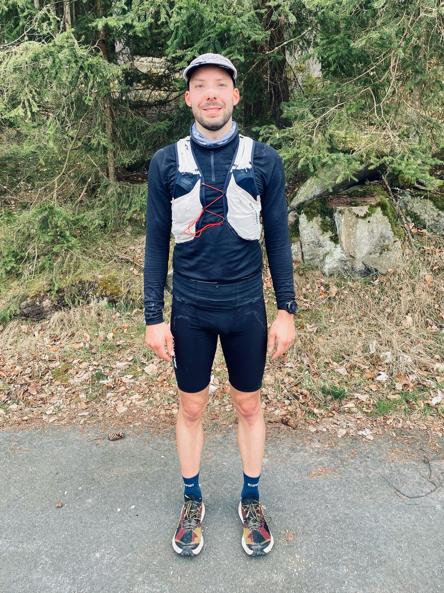

Ein weiterer Versuch von Christian, die [Fastest Known Time](https://fastestknowntime.com/fkt/christian-pecher-12-gipfel-tour-germany-2025-04-08) für die 12-Gipfel-Tour aufzustellen. Das Ziel war, die Tour in weniger als 6 Stunden zu absolvieren. Ob das geklappt hat?

## Strecke

## Style
Unsupported: Ich habe von Anfang an alle Verpflegung mitgenommen. Während des Abstiegs nach Karches habe ich meine Flaschen einmal an einer Wasserquelle aufgefüllt. Unterwegs bin ich außer anderen Wanderern, die ich nicht kenne, niemandem begegnet.

## Bericht

Ich habe das Auto bei der Alten Vorsuchhütte geparkt und ein kurzes Warm-up gemacht. Um 10:00 Uhr bin ich losgelaufen. Auf dem Weg zur Piste hoch fühlten sich meine Beine Beine sehr schwer an. Es schien nicht so, als ob das an diesem Tag eine Spitzenzeit werden würde.

Um 10:09 Uhr bin ich oben auf der Schönburgwarte (Kornberg) angekommen. Beim Downhill hatte ich bereits leichte Krämpfe in beiden inneren Oberschenkelmuskeln, was meine Zweifel noch verstärkte. Im flachen Stück Richtung Kirchenlamitz hatte ich zwar immer noch schwere Beine, aber die Krämpfe wurden weniger.

Um 10:59 Uhr bin ich oben auf der Aussichtsplattform am Epprechtstein angekommen. Ein Teil des Verschlusses am Zip-Beutel für das Handy reißt ab – Shite. Von nun an ist es jedes Mal ein ziemliches Gefummel, das Handy aus der Tüte zu bekommen.

Ich mache mich zügig auf den Weg Richtung Waldstein, die Krämpfe sind inzwischen fast weg. Kurzer Stopp, um die Flaschen zu wechseln, beim Aufstieg und erste kurze Pinkelpause.

Oben auf der Schüssel (Waldstein) bin ich um 11:38 Uhr. Die Sonne kommt heraus und es wird kurzzeitig sogar etwas warm.

Es folgt ein zügiger Downhill Richtung Weißenstadt. Um 12:24 Uhr bin ich oben am Aussichtspunkt Rudolfstein, um 12:46 Uhr auf dem Backöfele (Schneeberg). Weiter geht es Richtung Nußhardt. Um 12:57 Uhr erreiche ich den Gipfel.

Es folgt ein schneller Downhill nach Karches. Am Brunnen fülle ich meine Flaschen auf. Es wird bewölkter und kühler, also raus mit den Handschuhen. Beim Anstieg wieder kurze Pinkelpause.

Um 13:38 Uhr bin ich oben am Asenturm (Ochsenkopf). Langsam spüre die Anstrengung.

Um 14:25 Uhr ist die Platte erklommen und dann ein schneller Downhill bis zum Silberhaus-Parkplatz.

Der Anstieg zur Hohen Matze zieht sich. Um 14:56 Uhr erreiche ich das Gipfelkreuz. Mein Kopf beginnt zu schmerzen, wahrscheinlich habe ich bisher zu wenig Wasser getrunken.

Trotzdem folgt ein zügiger Anstieg, da mir langsam die Zeit ausgeht. Oben am Kösseine-Turm bin ich um 15:26 Uhr. Das erste Stück des Weges ist aufgrund umgefallener Bäume recht unwegsam. Ich werde langsamer.

Um 15:41 Uhr erreiche ich den Großen Haberstein, um 15:47 Uhr den Burgstein Felsen. Jetzt folgt ein Downhill-Sprint auf der Forststraße.

Um 15:55 Uhr komme ich am Denkmal an der Luisenburg an.
Endzeit: **05:55:33!**. Hier der Beweis auf [Strava](https://www.strava.com/activities/14116665410/overview). 

## Learnings

Diesmal wäre ein längeres Warm-up nötig gewesen. Ich hatte zu wenig Wasser dabei, vor allem gegen Ende. Das ist die größte Challenge der Tour, wenn man unsupported läuft, da es auf den ersten 30 km keine Wasserquelle gibt.
Die Aussichtstürme hochzugehen, Fotos zu machen und wieder runterzugehen, kostet viel Zeit. Bei 12 Gipfeln kommen so 20 bis 30 Minuten zusammen.

## Verpflegung

* 3735 ml Water
* 1x NDURANZ Nrgy Gel 45
* 1x SiS Nootropics Gel
* 320g Maurten 320 Drink Mix
* 250g NDURANZ Nrgy Unit 90 Drink Mix
* 9x 4ENERGY Salt Caps
* 1x NDURANZ Caffein Caps 

Total: 598g Carbs (101 g/h) 3581mg Sodium (605mg/h).
Überbleibsel: 1/4 Flasche mit Drink Mix

## Ausrüstung

* Salomon S/Lab 10L Pack
* iPhone 11
* Garmin Fenix 6Pro
* Schuhe: La Sportiva Prodigio Pro
* Cap
* Buff
* Handschuhe
* Running tights
* Long sleeve
* Regenjacke
* Rettungsdecke