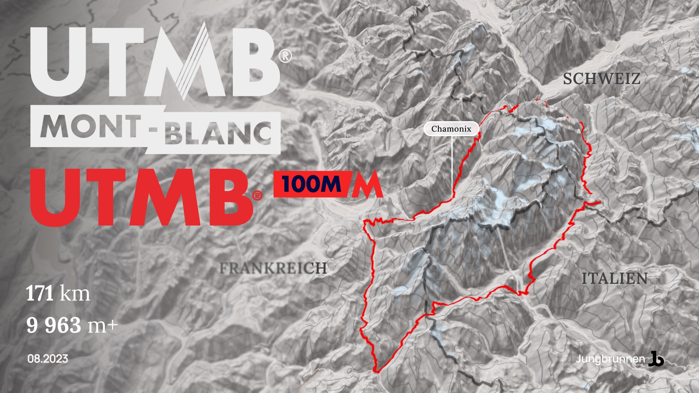

Am 25. August 2023 hatten die beiden Initiatoren hinter FichtelUltra, Christian Pecher und Jan Stricker, das Vergnügen, einen Vortrag im [Jungbrunnen in Selb](https://jungbrunnen-selb.de/) zu halten. Anhand einer Sammlung von Karten und Bildern gab es einen Einblick in Christian's persönliche Reise in die Welt des Trail- und Ultralaufs - eine Welt, die sowohl faszinierend skurril als auch unglaublich bereichernd ist.

")

## Ultra Trail du Mont Blanc 2023

Diese Reise wird bald fortgesetzt, denn es geht nach [Chamonix Mont-Blanc](https://de.chamonix.com/), wo Christian am legendären [UTMB - dem Ultra Trail du Mont Blanc](https://utmb.world/) - teilnimmt. Bei diesem 170 km langen Rennen wird das Mont-Blanc-Massiv umrundet, wobei fast 10.000 Höhenmeter im Aufstieg und 10.000 Höhenmeter im Abstieg zu bewältigen sind. 

Mit der Teilnahme erfüllt er sich einen großen Traum, ein Traum der von vielen anderen Trailläufer*innen auf der ganzen Welt geteilt wird. Die Vorfreude aber auch die Aufregung steigen.

>Knapp **47 Stunden** habe ich für die 170 km lange Route Zeit.

## Links und Infos

Wer noch mal einen Blick in den Vortrag im Jungbrunnen werfen will, kann die [Folien der Präsentation](https://www.figma.com/proto/pZUaecNRhv7q0AnA9ZH8tz/Ultra-Trails-Fichtelgebirge-x-Chamonix?page-id=0%3A1&type=design&node-id=1-2&viewport=353%2C24%2C0.02&t=NtYdLiWM9KPnxRZ8-1&scaling=contain&mode=design) hier aufrufen. 

Ein Mitschnitt des Vortrages ist [hier auf YouTube](https://youtu.be/cYYYXE_11sQ) zu sehen.

Ihr könnt Christian gerne auch auf [Strava](https://www.strava.com/athletes/24152579), [Komoot](https://www.komoot.de/user/510978844869) oder [Instagram](https://www.instagram.com/andthegoats/) folgen.