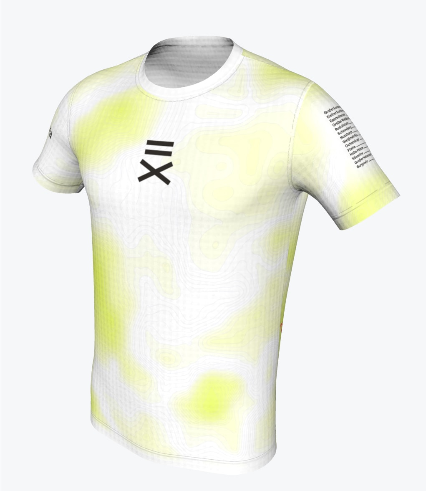
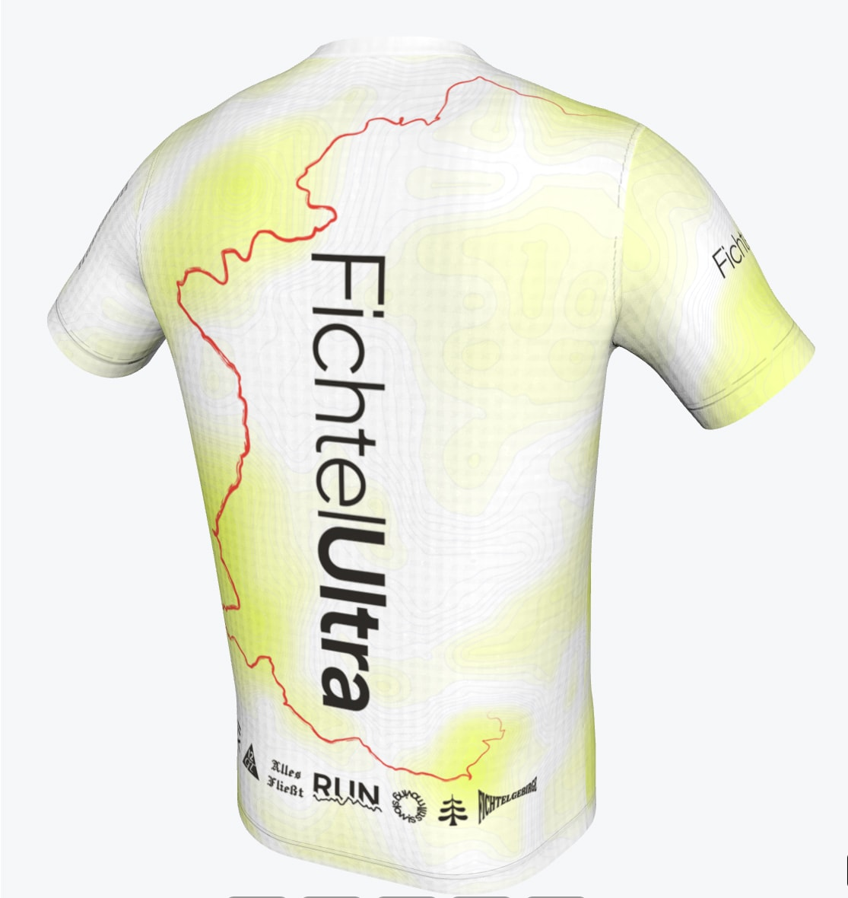

Ab sofort könnt ihr das erste FichtelUltra Team-Shirt unter folgendem Link vorbestellen!

    <a href="https://buy.stripe.com/fZu5kC7UEbCgaQ56N7g7e00" target="blank">
      <button class="btn inline">Jetzt vorbestellen</button>
    </a>

## Design

Das Design zeigt eine topografische Karte des Fichtelgebirges sowie die [Strecke des Fun Run 2](events/2025-10-18--fun-run-2/#strecke) entlang der vielen Erhöhungen. Auf einem Ärmel sind alle Gipfel und ihre Höhenmeter abgebildet und auf der Rückseite wird unser Logo durch diverse Grafiken begleitet. 

**Hinweis:** Aufgrund des digitalen Druckverfahrens in CMYK ist die Farbe voraussichtlich eher gelblich statt wirklich leuchtend Neon. Die Abbildungen können abweichen.

## Verfügbarkeit & Abholung

Die Shirts werden ab ca. Mitte September durch unseren Partner [Peppex Sports](https://www.peppex-sports.de/) produziert und können am Eventtag, den 18.10.2025, beim [Start- bzw. Zielbereich](/events/2025-10-18--fun-run-2/#verlauf) abgeholt werden.  

Nur Vorbesteller erhalten garantiert ein Shirt. Verkauf vor Ort sowie Versand nach dem Event sind voraussichtlich möglich,sofern nicht bereits alle Shirts vergriffen sind.

## Größen & Material

Das Shirt ist in den Größen S, M und L verfügbar, siehe [Größentabelle von Peppex Sports](https://www.peppex-sports.de/wp-content/uploads/2019/02/P223_Kurzarm_Groessentabelle_6XL_MG_12-3-24.jpg)

* 100% Polyester (Recycelter Polyester)
* Atmungsaktiv, schnell trocknend
* Kinder-, Damen- und Herrenschnitt
* COOLMESH Technologie; 135 g/m²
* Oeko Tex 100